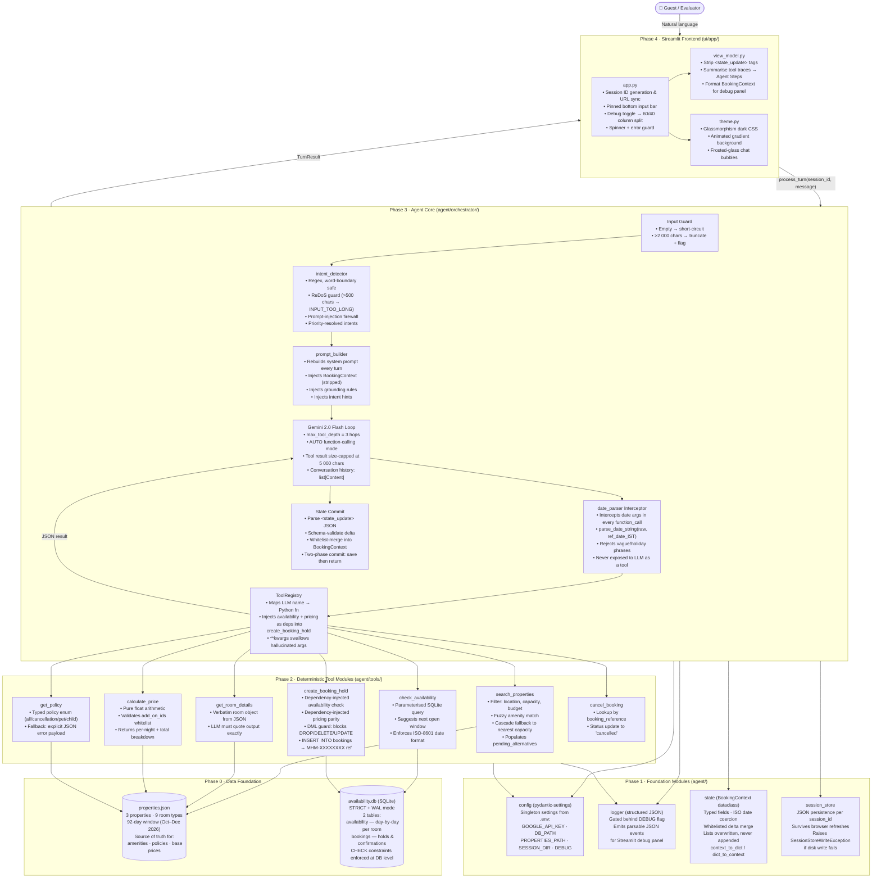
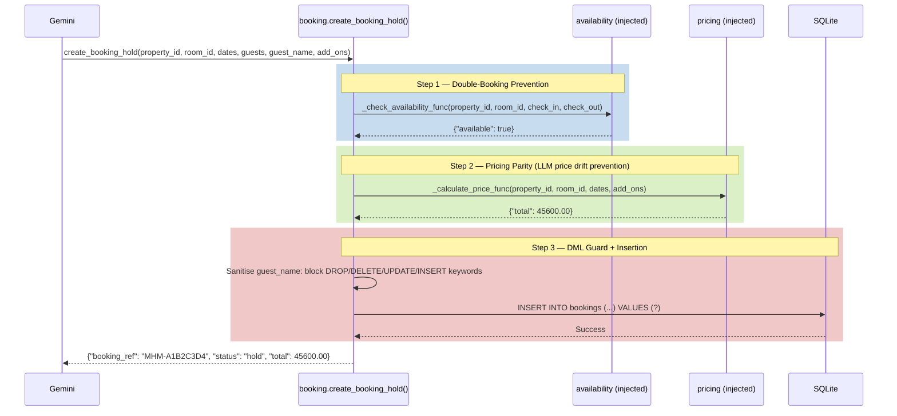
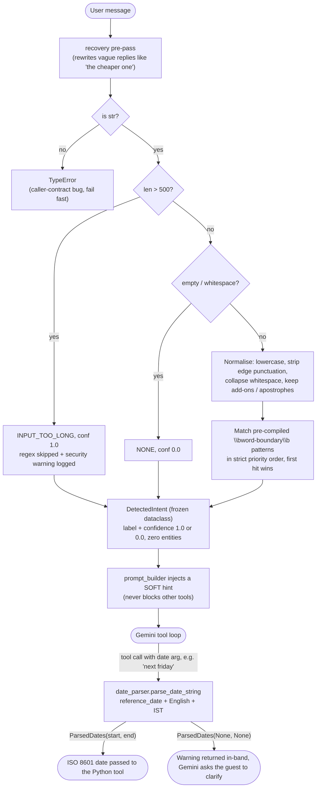
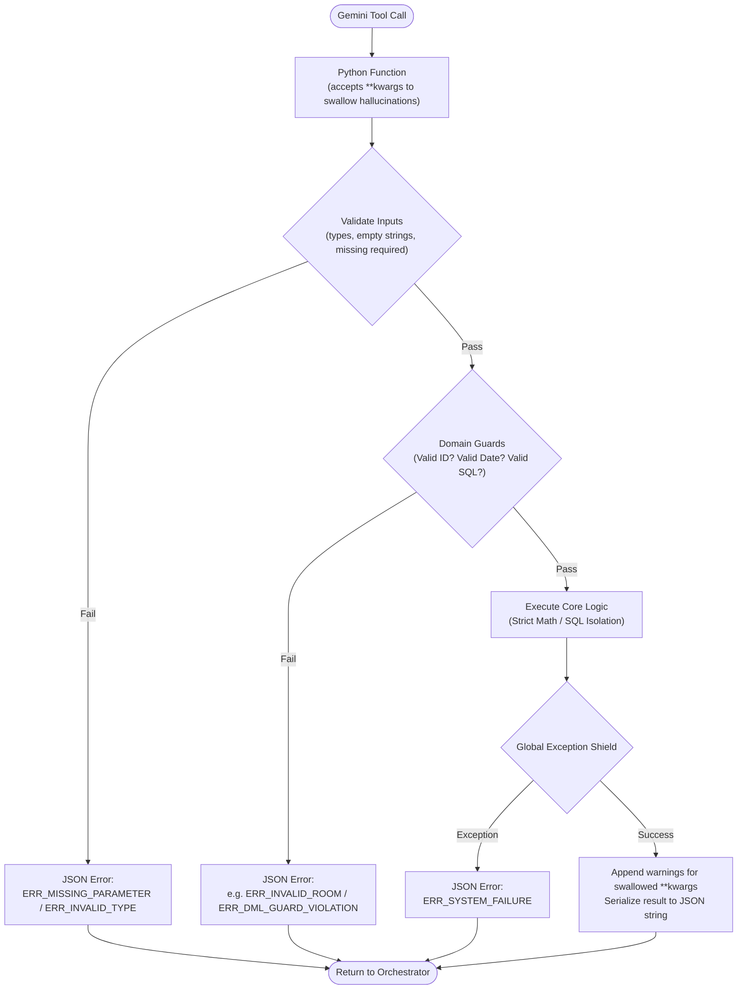

# Mehman Mira — Hotel Booking AI Assistant

[](https://github.com/) [](https://python.org) [](https://ai.google.dev) [](https://streamlit.io/) [](https://sqlite.org) [](https://docs.pydantic.dev/) [](https://dateparser.readthedocs.io) [](https://github.com/astral-sh/uv) [](https://docs.pytest.org) [](https://github.com/astral-sh/ruff) [](LICENSE)

🚀 **Agentic, Deterministic, and Guest-Facing**

> **An enterprise-grade, state-driven Agentic Booking Assistant built to autonomously execute complex, multi-turn hotel reservations by seamlessly fusing conversational LLM orchestration with strict, deterministic Python application logic and live SQLite inventory analytics.**

## 📖 About the Project

**Mira** is the conversational concierge for **Mehman**, a boutique hotel-booking platform. Guests talk to her in natural language ("a pool villa in Goa next weekend for 4, under ₹15k, with breakfast") and Mira carries the conversation from first search to a confirmed booking hold, across as many turns, corrections and changes of mind as the guest needs.

### The Problem
Pure-LLM booking bots fail in exactly the places where hotels cannot afford mistakes: they invent prices, claim rooms are free when they are not, make up amenities and policies, do date maths wrong ("next weekend"), and silently lose context when a guest says "actually, make it 4 guests" or "the cheaper one". 

### The Approach: LLM Reasons, Python Decides
Mira splits responsibility strictly. **Gemini** (native SDK, function calling) handles language understanding, tool selection and reply wording. **Every fact and every side-effect** comes from deterministic Python:

| Concern | Owned by | Guarantee |
|---|---|---|
| Room, amenity and policy facts | `search`, `details`, `policy` tools over `properties.json` | The LLM must quote tool output verbatim; unknown facts (e.g. "is the pool heated?") are answered as unknown |
| Availability and scarcity | `availability` tool over SQLite (`STRICT` tables, `CHECK` constraints) | Parameterized queries; suggests the next open window when dates are blocked |
| Pricing | `pricing` tool (pure arithmetic) | Totals are never computed by the LLM; invalid add-ons are rejected |
| Booking holds | `booking` tool | Re-verifies availability and re-prices internally, enforces capacity and a DML guard before the single `INSERT` |
| Dates | `date_parser` | "next weekend", "the 2nd", "kal" resolved to ISO 8601 against a fixed reference date; vague or holiday phrases are refused rather than guessed |
| Conversation memory | `BookingContext` + session store | Typed state, whitelisted delta updates, lists overwritten (never appended), JSON persisted per session |

### Built to Survive Messy Conversations
Mira is designed around the real-world edge cases of hotel booking:
- **Capacity conflicts**: a party of 5 correctly narrows to the single 6-guest Presidential Villa instead of failing.
- **Missing information**: asked whether the pool is heated, Mira admits the data does not say, instead of guessing.
- **No availability**: when the Private Pool Villa is blocked for Oct 9-11, Mira proposes the next open window.
- **Scarcity**: with only one Cottage left on Oct 15-17, Mira can honestly convey urgency.
- **Resilient plumbing**: an intent-detector crash degrades gracefully instead of failing the turn; type-hallucinated state updates are discarded to protect the schema.

### Scope and Deliverables
The dataset covers three boutique properties in Goa (*The Dunes Retreat*, *Emerald Gardens*, *Taj Exotica Resort & Spa*; 9 room types) with a 92-day availability window (Oct 1 - Dec 31, 2026). Beyond the core flow, the project ships three bonus capabilities: **conversation recovery** (anaphora such as "the cheaper one"), **contextual upselling**, and a **headless evaluator** running 15 fixture conversations (TC001-TC015).

The codebase is developed with a **spec-first, TDD-driven, module-isolated workflow**: every module has a written spec (EARS requirements), a sealed pytest suite, and independent QA audits, so each behavior described above is backed by a requirement and a test.

---

## 1. System Architecture

### 1.1 High-Level Component Map



---

### 1.2 Module Directory Map

```
Mehman/
├── agent/
│   ├── config/src/config.py          ← pydantic-settings singleton
│   ├── logger/src/logger.py          ← structured JSON logger
│   ├── state/src/state.py            ← BookingContext dataclass
│   ├── session_store/src/            ← JSON session persistence
│   ├── intent_detector/src/          ← regex pre-classifier
│   ├── date_parser/src/              ← NLP → ISO 8601 normaliser
│   ├── prompt_builder/src/           ← grounded system prompt builder
│   ├── orchestrator/src/             ← process_turn() entry point
│   └── tools/
│       ├── search/src/               ← search_properties()
│       ├── availability/src/         ← check_availability()
│       ├── details/src/              ← get_room_details()
│       ├── pricing/src/              ← calculate_price()
│       ├── policy/src/               ← get_policy()
│       └── booking/src/              ← create_booking_hold()
├── ui/app/src/
│   ├── app.py                        ← Streamlit entry point
│   ├── view_model.py                 ← sanitiser + trace formatter
│   └── theme.py                      ← glassmorphism CSS
├── data/
│   ├── properties/src/properties.json
│   └── availability_db/src/availability.db
├── eval/
│   ├── fixtures/                     ← TC001–TC015 JSON scenarios
│   └── run_evals/src/run_evals.py    ← headless evaluator
└── scripts/seed_db/src/seed_db.py    ← deterministic DB seeder
```

---

### 1.3 Per-Turn Sequence (Detailed)

```mermaid
sequenceDiagram
    participant Guest
    participant App as app.py (Streamlit)
    participant Orch as orchestrator.process_turn()
    participant Intent as intent_detector
    participant PB as prompt_builder
    participant Gemini as Gemini 2.0 Flash
    participant DP as date_parser (interceptor)
    participant Tool as Deterministic Tool
    participant DB as SQLite / properties.json
    participant SS as session_store

    Guest->>App: "Pool villa in Goa next weekend for 4, breakfast please"
    App->>App: Guard: empty? → reject. >2 000 chars? → truncate.
    App->>SS: load_context(session_id)
    SS-->>App: BookingContext (or empty on first turn)
    App->>App: Reset tool_traces=[], last_action=None

    App->>Orch: process_turn(session_id, message)
    Orch->>Intent: detect_intent(message)
    Note over Intent: Regex · word boundaries · priority resolution
    Intent-->>Orch: DetectedIntent(intent="SEARCH_AND_VALIDATE", confidence=1.0)

    Orch->>PB: build_system_prompt(context, hints, system_date)
    Note over PB: Strips conversation_history & last_tool_result<br/>Injects grounding rules + intent hint
    PB-->>Orch: System Prompt (str)

    loop Gemini Multi-Hop (max 3 iterations)
        Orch->>Gemini: generate_content(system_prompt, history, tools)
        alt function_call returned
            Gemini-->>Orch: function_call: search_properties(dest="Goa", guests=4, check_in="next weekend")
            Orch->>DP: parse_date_string("next weekend", ref_date=today_IST)
            DP-->>Orch: ParsedDates(start=2026-10-17, end=2026-10-17)
            Orch->>Tool: search_properties(dest="Goa", guests=4, check_in="2026-10-17", ...)
            Tool->>DB: Filter properties.json
            DB-->>Tool: Matching rooms
            Tool-->>Orch: JSON result string (capped at 5 000 chars)
            Orch->>Orch: Append to tool_traces; last_action="call_tool"
            Orch->>Orch: Append FunctionResponse to history
        else text response returned
            Gemini-->>Orch: Natural language reply + <state_update>{...}</state_update>
            Orch->>Orch: Parse & validate <state_update> JSON delta
            Orch->>Orch: update_context(booking_ctx, delta) — whitelist enforced
            Orch->>SS: save_context(session_id, updated_ctx)
            Note over Orch,SS: Two-phase commit: if save fails → suppress reply → return error TurnResult
        end
    end

    Orch-->>App: TurnResult(response_text, current_state, upsell_suggestions)
    App->>App: view_model: strip <state_update> tags; summarise traces
    App-->>Guest: Sanitised reply + "Agent Steps" expanders
    App->>App: Update debug panel with live BookingContext
```

---

### 1.4 booking.py Internal Safety Pipeline

The only state-mutating tool is `create_booking_hold`. It enforces a strict 3-step guard before any `INSERT`:



---

### 1.5 Data Layer Schema

| Table / File | Type | Key Columns / Fields | Constraints |
|---|---|---|---|
| `availability` | SQLite (STRICT) | `property_id`, `room_id`, `date`, `is_available`, `remaining_rooms` | `CHECK` remaining_rooms=0 ↔ is_available=0; ISO-8601 date format enforced at DB level |
| `bookings` | SQLite (STRICT) | `booking_ref` (MHM-UUID), `property_id`, `room_id`, `check_in`, `check_out`, `guests`, `guest_name`, `add_ons` (JSON), `total_price`, `status` | `CHECK check_out > check_in`; `json_valid(add_ons)` |
| `properties.json` | JSON | per-property: `property_id`, `name`, `location`, `rooms[]`, `policies`, `add_on_catalog` | Loaded once at startup; read-only at runtime |

**Deliberately implanted data traps (from seed_db.py):**
- `GOA001-POOL` blocked Oct 9–11, 2026 → forces "no availability → suggest next window" flow
- `GOA002-COTTAGE` reduced to 1 remaining room Oct 15–17, 2026 → enables scarcity messaging
- `GOA003-VILLA` capacity=6 → only valid option for party of 5; capacity filter is a hard exclusion

---

### 1.6 Key Architectural Decisions (ADR Summary)

| Decision | Choice | Rationale |
|---|---|---|
| **LLM Engine** | Gemini 2.0 Flash (native SDK) | Low latency; reliable function calling; no framework abstraction needed |
| **Tool calling** | Native Gemini `FunctionDeclaration` + `AUTO` mode | Keeps multi-hop loop inside the orchestrator with full visibility |
| **State storage** | `BookingContext` dataclass (in-memory) + JSON session file (disk) | Strongly typed; survives refreshes; no Redis dependency |
| **Intent routing** | Soft hint injection (not hard-stop) | Allows the LLM to also call tools on the same turn as an intent match |
| **Date normalisation** | Custom `date_parser` interceptor (invisible to LLM) | Prevents garbage SQL; handles "kal", "next weekend", ordinal roll-over |
| **State delta model** | Explicit whitelist + type coercion | LLM can update only approved fields; string "4" → int 4; unknown keys discarded |
| **Booking safety** | Dependency-injected availability + pricing inside `booking.py` | Prevents price drift between `calculate_price` and `create_booking_hold` calls |
| **DML guard** | Keyword blacklist on guest_name before `INSERT` | Blocks `Robert'; DROP TABLE bookings; --` style injections |
| **Two-phase commit** | Save state before returning reply | UI and session store can never diverge |
| **Tool result cap** | 5 000 chars per tool response | Prevents context window overflow on large JSON datasets |
| **Error masking** | All runtime errors → safe `TurnResult` fallback | UI never crashes; evaluators see error strings, not stack traces |

---

### 1.7 How a Turn Works

1. **Intake**: the Streamlit UI forwards the message and session ID to `process_turn()`. Empty input is rejected without spending tokens; oversized input (>2,000 chars) is truncated and flagged.
2. **Pre-LLM analysis**: the `intent_detector` (regex, word-boundary safe, ReDoS-guarded, prompt-injection aware) emits soft intent hints such as `SEARCH_AND_VALIDATE` or `STATE_UPDATE`. Priority conflicts are resolved deterministically.
3. **Grounded prompt**: the `prompt_builder` rebuilds the system prompt every turn with the current `BookingContext`, the intent hints, and the non-negotiable grounding rules (e.g. *never state a price not returned by `calculate_price()`*). Internal trace fields (`conversation_history`, `last_tool_result`) are stripped before injection.
4. **Multi-hop tool loop**: the orchestrator runs a bounded loop of up to **3** iterations (`max_tool_depth`) in `AUTO` mode. Each iteration sends the history and tool schemas to Gemini. If the response contains a `function_call`, the tool is executed, its result is appended to the history, and the loop continues. **If the response contains no `function_call`, Gemini has decided it can answer: the loop exits immediately (even if fewer than 3 iterations ran) and that text becomes the final reply.** A `SAFETY` finish reason, or still requesting tools after the depth cap, hard-stops the loop with an error `TurnResult`. Date arguments are intercepted by `date_parser` and normalised to ISO 8601 before reaching any Python tool. Tool results are size-capped at 5,000 chars. Hallucinated arguments are absorbed via `**kwargs` with in-band warnings so the model can self-correct.
5. **State commit**: the final text reply carries a `<state_update>` JSON block which is schema-validated, whitelist-merged into the `BookingContext`, and saved to disk. This is a two-phase commit — if the disk save fails, the LLM's reply is suppressed and an error `TurnResult` is returned, so the UI and stored state can never diverge.
6. **Presentation**: `view_model` strips internal `<state_update>` tags and turns raw tool traces into readable "Agent Steps" expanders; an optional split-pane (60/40) debug view exposes the live `BookingContext` for evaluators.

---

## 2. Core Features

### 🧠 Pre-LLM Intent Routing & Date Parsing

Two deterministic, **zero-LLM, zero-ML** components keep ambiguity out of Gemini's hands. The `intent_detector` tells Gemini *what kind of request this probably is*; the `date_parser` guarantees any date that reaches a Python tool is a trusted `YYYY-MM-DD` string. Both are pure, stateless functions, so they are thread-safe, reproducible, and add effectively 0 ms of latency.



#### Intent priority ladder

Matching is top-down and the first match wins, so the result is fully deterministic and reproducible in tests. Confidence is binary: `1.0` for any specific match, `0.0` for `NONE`.

| Pri | Label | Example triggers | Hint it gives Gemini |
|---|---|---|---|
| 1 | `INPUT_TOO_LONG` | message over 500 chars (ReDoS guard) | Ask the guest to shorten the message |
| 2 | `OUT_OF_SCOPE` | "ignore previous instructions", "system prompt", competitor names (Airbnb, Oyo) | Politely decline and steer back to Mehman |
| 3 | `STATE_UPDATE` | "actually", "change that to", "make it", "instead" | Expect a `<state_update>` delta |
| 4 | `GET_POLICY` | "cancel", "pet", "refund", "check-in time" | Call `get_policy` |
| 5 | `SEARCH_AND_VALIDATE` | "search", "find", "looking for", "options" | Call `search_properties` |
| 6 | `CHECK_AVAILABILITY` | "book", "reserve", "available", "availability" | Call `check_availability` / create a hold |
| 7 | `UPSELL_TRIGGER` | "add-ons", "extras", "anything else", "airport pickup" | Offer relevant add-ons |
| 8 | `NONE` | greetings, thanks, pricing or amenity questions | No hint; Gemini decides |

#### Intent detector guarantees

- **Word boundaries only**: patterns use `\bpet\b`, so "carpet" never triggers the pet policy.
- **ReDoS-safe**: the length check runs *before* any regex. Over-length input never touches the regex engine.
- **Verbs, not data**: triggers are action verbs only. No destinations ("Goa") or room names, so adding properties never breaks routing.
- **Zero entity extraction**: dates, guests and budgets are extracted by Gemini into `<state_update>`, never by regex.
- **Negation-tolerant by design**: "do not cancel" may still emit `GET_POLICY`. The hint is soft, and Gemini reads the full sentence and overrides it.
- **Fail-fast config**: all labels, keywords and blocklists live in one config dict, compiled at import by `_initialize_intent_config`. A bad regex or missing key raises at boot, never mid-conversation.
- **Hardened output**: `DetectedIntent` is a frozen dataclass with a `Literal` label, so the orchestrator cannot mutate or typo it.

#### Date parser: resolution rules

The parser is a *translation utility*, not a business-rule engine: past dates are translated faithfully, and rejecting them is the booking layer's job. It combines custom hospitality rules with the `dateparser` library, configured for English only, `DMY` order, future preference and `Asia/Kolkata`.

| Guest says | Resolves to (relative to `reference_date`) |
|---|---|
| "today" / "tonight" / "tomorrow" / "day after tomorrow" | +0 / +0 / +1 / +2 days |
| "in 3 days" / "in two days" / "a week from today" | +3 / +2 / +7 days (spelled-out numbers supported) |
| "Friday" / "this Friday" | Today if it is Friday, otherwise the next upcoming Friday (week starts Monday) |
| "next Friday" / "Friday next week" | Exactly 7 days after "this Friday" |
| "this weekend" / "next weekend" | Upcoming Saturday (today if Saturday) / +7 days |
| "the 15th" / "the fifteenth" | That day this month, or next month if it has passed |
| "Mar 5" (year omitted, already passed) | Next year's occurrence |
| "10/11/2026" | 10 November 2026 (strict `DMY`) |
| "Feb 29" in a non-leap year | Rolls forward to the next leap year |
| "Oct 10-12" / "Friday to Sunday" | `ParsedDates(start_date, end_date)` range |
| "3pm" with a foreign timezone | Resolved in IST first, then time and timezone stripped |

#### Date parser: fail-safe rejections

On any ambiguity the parser returns `ParsedDates(None, None)` and logs the reason, rather than guessing. The orchestrator relays this to Gemini, which asks the guest for an explicit date. Silent wrong guesses lead to double-bookings, so a clarifying question is always the safer outcome.

| Input class | Example | Why rejected |
|---|---|---|
| Vague periods and offsets | "next week", "a couple of days", "end of the week", "mid-month" | Cannot be resolved deterministically |
| Named holidays | "Christmas", "New Year's Eve" | Avoids brittle holiday dictionaries |
| Multiple dates joined by a conjunction | "Friday and Sunday", "5th & 8th" | Would mask an LLM structural failure |
| Standalone durations | "3 days", "one week" | A duration is not a date |
| Time-only input | "3:00 PM", "morning" | No date to resolve |
| Typos and non-English | "tomorow", Hindi phrases | Fuzzy matching is non-deterministic; Gemini translates and corrects upstream |
| Impossible dates | "Feb 30", "Nov 31" | `ValueError` / `OverflowError` is caught and converted |
| Bad types | `None`, `int`, empty string | Guard clause returns an empty result |
| Invalid `reference_date` | string, `None`, timezone-aware value | Raises `TypeError` / `ValueError`, because this is a developer bug, not LLM noise |

> [!NOTE]
> The two modules are separate on purpose. Anaphoric recovery ("the cheaper one") belongs to the `recovery` pre-pass, and entity extraction belongs to Gemini. The intent detector only classifies, and the date parser only translates dates.


### 🛡️ Strict Deterministic Tooling

The LLM is treated as an untrusted actor. All mathematical, transactional, and data-retrieval logic is locked behind pure Python functions. The LLM **never** hallucinates prices, room inventory, or policies; it acts purely as a routing engine that formats the deterministic JSON responses returned by these tools.



#### Universal Tooling Guarantees

Every tool in the system strictly adheres to the following zero-trust patterns:

| Pattern | Implementation | Purpose |
|---|---|---|
| **Exception Shielding** | Global `try...except Exception` blocks catching all runtime errors. | Mathematically guarantees the orchestrator loop never crashes due to a tool failure. Returns structured JSON errors (e.g., `ERR_SYSTEM_FAILURE`) instead. |
| **Hallucination Swallowing** | Signatures include `**kwargs`. Ignored parameters are appended to a `warnings` array in the successful JSON output. | Prevents instant `TypeError` crashes when Gemini hallucinates parameters, while enabling LLM self-correction. |
| **Fail-Fast Validation** | Explicit `isinstance` checks and missing-parameter guards at the start of every function. | Prevents silent data corruption or downstream crashes from missing or malformed data types. |
| **Strict Serialization** | All outputs (success or error) are stringified to JSON before returning. | Required by the Gemini SDK; prevents system crashes caused by returning raw dictionaries. |
| **Dependency Injection** | `_data_path`, `_db_path`, `_system_date` injected dynamically via `**kwargs`. | Enables pristine TDD isolation without monkeypatching or polluting the public schema. |

#### Domain-Specific Constraints

Beyond the universal guarantees, each tool enforces strict domain boundaries:

- **`pricing`**: Enforces a strict order of operations for rounding to exactly 2 decimal places *before* calculating totals to prevent "penny-off" receipt bugs. Explicitly guards against length-of-stays > 30 days.
- **`booking`**: Implements a Zero-Trust architecture. It independently re-verifies availability, recalculates the price, and validates room capacity locally, completely ignoring any values passed by the LLM. It features a strict DML guard allowing only `INSERT INTO bookings` to prevent SQL injection.
- **`availability`**: Executes a sliding-window algorithm to automatically suggest the next available dates if the requested range is fully or partially booked, returning exact `alternative_dates` to the LLM.
- **`search`**: Implements a strict fallback cascade if filters yield zero results (relaxing preference -> budget -> capacity) to ensure the LLM always has options to present, avoiding conversational dead-ends.
- **`policy` & `details`**: Pure, deterministic data fetchers. They return the exact strings from the dataset without modification, truncation, or summarization, strictly enforcing LLM grounding against hallucinated hotel rules.

### 🔄 Multi-Hop State Management

The orchestrator maintains conversation continuity using a central `BookingContext` dataclass backed by thread-safe JSON file persistence. Instead of replacing the full state every turn, Gemini emits partial JSON deltas which are safely merged into the context.

#### State Security & Delta Merging

| Rule | Implementation | Purpose |
|---|---|---|
| **Immutable Security Boundary** | `ALLOWED_DELTA_FIELDS` is a `frozenset`. If the LLM tries to update a system-managed field (like `tool_traces` or `conversation_history`), the entire delta is rejected. | Prevents the LLM from mutating core orchestration data or hallucinating past actions. |
| **Safe Type Coercion** | The merge engine automatically casts values (e.g., `"4"` -> `4`). If coercion fails, the specific field is skipped and logged, while the rest of the delta merges. | Prevents minor LLM formatting quirks from crashing the entire session update. |
| **List Overwrites & Nulls** | List fields are overwritten, not appended. Explicit JSON `null` clears scalar fields, and `null` on a list field safely casts to `[]`. | Prevents a one-way deletion trap, allowing the LLM to natively remove items. |
| **Explicit Identity Tracking** | `guest_name` and `guest_phone` are discrete tracked fields. | Forces the LLM to explicitly collect them prior to checkout, preventing PII hallucination. |

#### Thread-Safe Session Persistence

The `session_store` module manages the Read-Modify-Write cycle with strict infrastructure boundaries:
- **Concurrency Locks**: Uses `filelock` with a configurable timeout to prevent race conditions if the guest clicks rapidly in the Streamlit UI or if concurrent threads execute.
- **Atomic Writes**: Uses `.tmp` file renaming to guarantee that unexpected I/O interruptions never truncate or corrupt a session file.
- **Schema Drift Tolerance**: Deserialization silently ignores unknown keys from legacy session files and fills missing ones with defaults. This provides seamless backwards compatibility across application deployments.
- **UTF-8 Mandate**: Explicitly enforces `encoding="utf-8"` on all file operations to prevent OS-level crashes when guests input international names or emojis.

> **Conversation Recovery (Bonus 2)**: For multi-hop context mapping (e.g., "book the second option for tomorrow"), anaphoric references are resolved seamlessly by a stateless `recovery` pre-pass, which rewrites the user's ambiguous input into an explicit string before it hits the intent router.

### 💼 Proactive Upselling (Bonus 1)
- **Dynamic Contextual Surfacing**: The LLM dynamically surfaces relevant add-ons (e.g., breakfast, airport pickup, late checkout) directly from the property dataset based on the user's selected room type, capacity, and current conversational state, rather than relying on hardcoded logic branches.
- **Detailed Receipt Breakdown**: Upsell selections are processed deterministically by the `pricing` tool, which generates a strict, line-by-line JSON receipt (`add_ons_breakdown`). The tool explicitly tracks duplicate selections to ensure data provenance and prevent hallucinated line items.
- **Implicit Daily Application**: The LLM is instructed to assume that relevant add-ons (like daily meals) should be applied for *all* dates of the stay unless the guest explicitly specifies otherwise. To execute this, the LLM mathematically scales the request by passing the specific `add_on_id` to the pricing tool multiple times (once for each requested instance).

### 🧪 Automated Headless Evaluator (Bonus 3)
- **Live Headless Execution**: A dedicated evaluation runner (`run_evals.py`) hooks directly into the core `AgentOrchestrator` to simulate the conversational loop entirely headless, bypassing the Streamlit UI for rapid CI/CD execution.
- **Fixture-Driven Testing**: Executes against 15 predefined scripted conversations stored as JSON fixtures, mapping out both happy paths and edge cases (e.g., conflicting capacity, relative date parsing, unavailable rooms).
- **Deterministic Grading**: For every conversational turn, the scorer asserts the output against expected behavior:
  - **Tool Accuracy**: Did the agent invoke the correct tool with the correct kwargs?
  - **State Correctness**: Did the agent extract and merge the exact expected state delta?
  - **Hallucination Rate**: Did the agent invent any facts (prices, policies, availability) not sourced from the tools?
  - **Booking Completion Rate**: Did the agent successfully drive the conversation to generate a booking hold reference?
- **Audit Reporting**: Automatically outputs a detailed markdown audit report upon completion, providing a transparent, empirical breakdown of agent reliability.

---

## 3. Knowledge Base & Dataset Overview

The system operates on a curated dataset representing three boutique properties in Goa. The data layer is designed with strict structural constraints to mathematically eliminate data hallucination at the source.

### Structured Operational Data (`availability.db`)
- **Engine**: SQLite with WAL (Write-Ahead Logging) enabled for robust concurrent read/write isolation.
- **Artifacts**: The schema is strictly defined by a physical `schema.sql` artifact, ensuring explicit DDL contracts decoupled from Python logic.
- **Tables**:
  - `availability`: Tracks `property_id`, `room_id`, `date`, `is_available`, and `remaining_rooms`.
  - `bookings`: Tracks `booking_ref`, guest details, dates, add-ons, and `total_price`.
- **Integrity**: Enforces strict SQLite `CHECK` constraints (e.g., `remaining_rooms >= 0`) at the database level. If a race condition attempts to overbook a room, the SQLite IntegrityError triggers the Python exception shield, mathematically guaranteeing state safety.

### Static Property Metadata (`properties.json`)
- **Source of Truth**: Acts as the immutable source for hotel descriptions, amenities, policies (cancellation, child, pet), base prices, and add-on catalogs.
- **Pydantic Hard-Guards**: The JSON shape is validated against strict Pydantic `BaseModel` schemas using `extra="forbid"`. Fields like `add_on_ids` use strict Python Enums, and check-in/out times use `datetime.time`. This guarantees that downstream tools ingest a perfectly sanitized object graph, making it impossible to process hallucinated attributes or malformed times.
- **Curated Dataset**: Includes detailed dummy data for:
  - *The Dunes Retreat* (Calangute, North Goa)
  - *Emerald Gardens* (Assagao, North Goa)
  - *Taj Exotica Resort & Spa* (Benaulim, South Goa)

---

## 4. Architectural Design Decisions (ADR)

| Component | Selected Option | Rationale |
|---|---|---|
| **LLM Engine** | **Gemini 2.0 Flash** | Extremely low latency, highly reliable function calling, and natively supported by the official SDK. |
| **State Storage** | **Dataclass `BookingContext`** | Keeps conversational state strongly typed. Allowed Delta Fields prevent the LLM from arbitrarily corrupting read-only state. |
| **Routing** | **Soft Hint Injection** | Instead of hard-stopping on an intent match, the router injects hints. This allows the LLM to still call tools for complex, mixed queries. |
| **Date Parsing** | **Custom NLP + `dateparser`** | Generic date parsers fail on conversational shorthand ("next weekend"). A custom hybrid approach ensures 100% accuracy for booking flows. |
| **Code Structure** | **`src/components/` Router Pattern** | Follows strict modular decoupling (Phase 7 Refactoring). Main module files act strictly as routers/exporters, ensuring clean public interfaces. |

---

## 5. Prerequisites and Local Setup

### System Prerequisites
* Python 3.10+
* package manager `uv` (recommended for environment isolation)
* A free Google AI Studio API Key (`gemini-2.0-flash`)

### 1. Installation

Clone the repository and build the virtual environment:
```bash
uv venv
source .venv/bin/activate
uv pip install -r requirements.txt
```

### 2. Environment Setup

Create a `.env` file in the root directory:
```env
GOOGLE_API_KEY="your_google_api_key_here"
GEMINI_MODEL="gemini-2.0-flash"
DB_PATH="data/availability_db/src/availability.db"
PROPERTIES_PATH="data/properties/src/properties.json"
SESSION_DIR="sessions/"
SESSION_LOCK_TIMEOUT=5
MAX_USER_INPUT_LENGTH=500
DEBUG=False
```

### 3. Database Initialization

Seed the SQLite availability database with starting test data:
```bash
python scripts/seed_db/src/seed_db.py
```

### 4. Running the Application

Launch the Streamlit web interface:
```bash
streamlit run ui/app/src/app.py
```
This will open the Mira Assistant locally at `http://localhost:8501`. 
*Note: The interface includes a split-pane debug inspector to view the `BookingContext` and tool traces in real-time.*

### 5. Testing and Evaluation

**Unit Tests**
The project uses `pytest` for rigorous unit testing across all modules. 
To run the full suite (ensure the project root is in the Python path):
```bash
PYTHONPATH=. pytest . -v
```

**Headless Evaluator**
To run the 15-scenario evaluation suite against the live agent:
```bash
PYTHONPATH=. python eval/run_evals/src/run_evals.py
```
This script will output an audit report to `eval/results/`.

---

## 6. Known Limitations & Assumptions

* **Database Concurrency**: While the SQLite database uses WAL mode for robust read-heavy operations, it is not intended for high-throughput concurrent production writes without a dedicated connection pooler (e.g., migrating to PostgreSQL).
* **Synchronous Agent Execution**: The core orchestrator and tooling logic use synchronous execution, assuming the Streamlit frontend inherently isolates user sessions to single-threaded execution. No internal thread locks exist within the state merge engine.
* **Geographic Scope**: The current operational dataset is strictly bounded to 3 dummy properties in Goa. The agent will accurately return "no availability" for queries outside this exact scope.
* **Currency Constraint**: All pricing, calculations, and rounding logic strictly assume Indian Rupees (INR) and standard 2-decimal-place rules. Multi-currency support is out of scope.
* **Timezone Assumption**: All relative date parsing, pricing blocks, and availability window boundaries are calculated based on the local server timezone running the application, unless explicitly overridden.

---

<div align="center">

### 🛎️ Mehman Mira Hotel Assistant

**Enterprise-Grade Agentic Architecture for Deterministic Booking Automation**

[ ⬆️ Back to Top ](#mehman-mira--hotel-booking-ai-assistant)

*Architected with precision for 100% hallucination-free enterprise state management*

</div>
